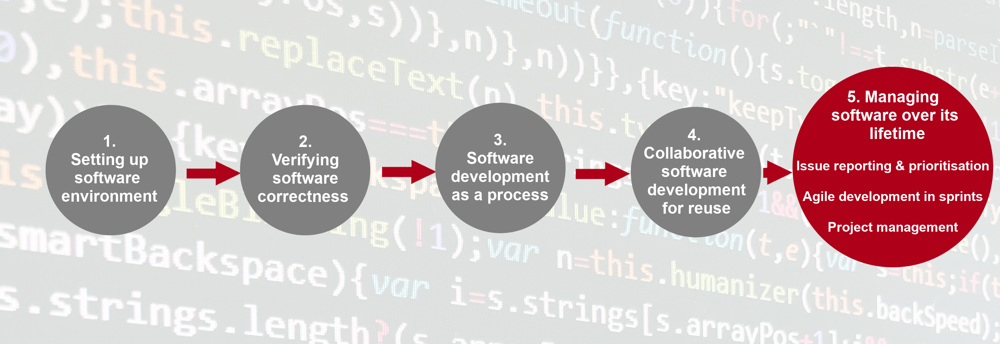

::::::::::::::::::::::::::::::::::::::: objectives

- Use established tools to track and manage software problems and enhancements in a team.
- Understand the importance of critical reflection to improving software quality and reusability.
- Improve software through feedback, work estimation, prioritisation and agile development.

::::::::::::::::::::::::::::::::::::::::::::::::::

:::::::::::::::::::::::::::::::::::::::: questions

- How do we manage the process of developing and improving our software?
- How do we ensure we reuse other people's code while maintaining the sustainability of our own software?

::::::::::::::::::::::::::::::::::::::::::::::::::

In this section of the course we look at managing the **development and evolution** of software -
how to keep track of the tasks the team has to do,
how to improve the quality and reusability of our software for others as well as ourselves,
and how to assess other people's software for reuse within our project.
The focus in this section will move beyond just software development to **software management**:
internal planning and prioritising tasks for future development,
management of internal communication as well as
how the outside world interacts with and makes use of our software,
how others can interact with ourselves to report issues,
and the ways we can successfully manage software improvement in response to feedback.

{alt='Managing software' .image-with-shadow width="800px" }

In this section we will:

- Use GitHub to **track issues with our software** registered by ourselves and external users.
- Use GitHub's **Mentions** and notifications system to
  effectively **communicate within the team** on software development tasks.
- Use GitHub's **Project Boards** and **Milestones** for project planning and management.
- Learn to manage the **improvement of our software through feedback**
  using **agile** management techniques.
- Employ **effort estimation** of development tasks
  as a foundational tool for prioritising future team work,
  and use the **MoSCoW approach** and software development **sprints** to manage improvement.
  As we will see, it is very difficult to prioritise work effectively
  without knowing both its relative importance to others
  as well as the effort required to deliver those work items.
- Learn how to employ a critical mindset when reviewing software for reuse.


Managing Software Development

- **Improving and managing** software post-release
- **Tracking user and developer feedback** via software issues
- **Improving software** through estimation, prioritisation and agile development
  

:::::::::::::::::::::::::::::::::::::::: keypoints

- For software to succeed it needs to be managed as well as developed.
- Estimating the effort to deliver work items is a foundational tool for prioritising that work.

::::::::::::::::::::::::::::::::::::::::::::::::::

