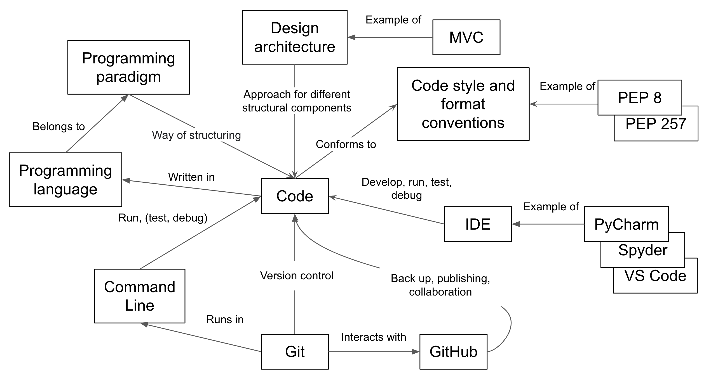

## Introduction
So, you have gained basic software development skills either by self-learning or attending, e.g., a [novice Software 
Carpentry course][swc-lessons]. You have been applying those skills for a while now by writing code to help with your work and you 
feel comfortable developing code and troubleshooting problems to a certain extent. However, your software 
has now reached a point where there’s too much code to be kept in one script. It is perhaps involving more 
researchers (developers) and users, and more collaborative development effort is needed to add new functionality 
while ensuring previous development efforts remain functional and maintainable. At this point, 
it becomes particularly important that you rethink the design of your software, including:

- **algorithm design**: what method are you going to use to solve the core problem?
- **software architecture**: what components will the software have and how will they interoperate?
- **system architecture**: what system components will this software have to interact with and how?
- **UI/UX (User Interface / User Experience)**: how will users interact with the software?

This lesson teaches the above intermediate-level software development topics in a way that mimics a typical collaborative 
software development process. It will teach you to use a number of different **software development tools and techniques** 
simultaneously and interchangeably as you would use them in a real life, including:
- **Integrated Development Environment
(IDE) tools** to help with **code development, testing and debugging**, 
- **command line tool** for running code and interacting with **version control system (Git)**, and
- **GitHub** (source code management platform supporting version control with Git) for 
**sharing and developing code collaboratively** within a team (and implicitly storing and backing up code), 
project managing your software development life-cycle, and **releasing code to users**.

After attending this workshop, you will be equipped with skills and tools for intermediate software development in Python, 
as well as general skills on writing robust software collaboratively making it easier to use, develop, 
and sustain it in the future for yourself and others. Note that, while this material is Python-specific 
and we had to select a particular IDE to focus the material on (PyCharm), most of the skills taught here are transferable to other 
programming languages and IDEs. We list different options and ways of working whenever possible and also see the 
[wrap-up episode](../wrap-up/index.html)
for a comprehensive list of references to alternative tools and further reading. 

Diagram below depicts tools and techniques we will be using and learning throughout this workshop and gives a high-level overview 
of how they fit together.

> ## Prerequisite Knowledge
> This is an intermediate-level software development course intended for people who have already been developing code in 
> Python (or other languages), e.g. for at least a few months, and applying it to their own problems 
> after gaining basic software development skills. 
> So, it is expected for you to have some prerequisite knowledge on the topics covered, as outlined at the [beginning of the lesson](/index.html#prerequisites).
Check out this [quiz](../quiz/index.html) to help you test your prior knowledge and determine if this course is for you.  
{: .callout} 

> ## Required Software
Please make sure that you have all the necessary software installed as described in the [Setup](../setup.html) section. 
This section also contains instructions on how to test your setup. 
{: .callout} 

> ## Outdated Screenshots
> Throughout this lesson we will make use and show content from Graphical User Interface (GUI) tools (PyCharm and GitHub). 
> These are evolving tools and platforms, always adding new features and new visual elements. 
> Screenshots in the lesson may then become out-of-sync, refer or show content that no longer exists or is different to 
> what you see on your machine. If during the lesson you find screenshots that no longer match what you see or have 
> a big discrepancy with what you see, please open an issue describing what you see and how it differs from the lesson 
> content. Feel free to add as many screenshots as necessary to clarify the issue.
{: .callout} 


