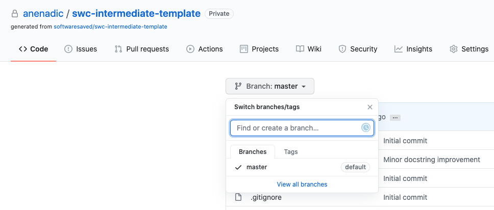
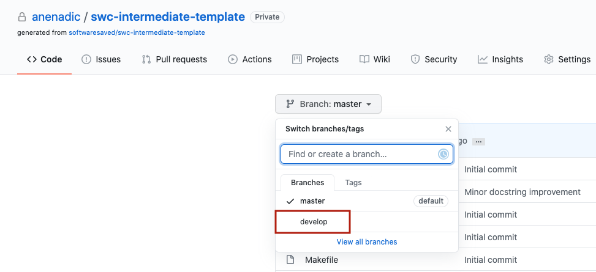

So far we have checked out our software project from GitHub, learned how to configure and use PyCharm for Python 
code development, and learned about Python coding conventions for writing clean and clear code. We have also made some 
changes to our code and now we want to check those changes in and share them with others.

Let's look into what we have changed and remind ourselves how to work with git from command line.

## Short git refresher
 

Diagram: Git lifecycle, https://www.pngwing.com/en/free-png-sazxf

The first thing to do is to check the current status of our local repository.
~~~
git status
~~~
{: .language-bash} 

~~~
On branch master
Your branch is up to date with 'origin/master'.
~~~ 
{: .output} 

As you can see, we have made changes to `patientdb.py` and `models.py` files. We have not committed those changes yet 
to our local copy. And we have not pushed the changes to the remote repository.

To commit to the local repository, we fist add the files to staging area (to prepare them for committing):
~~~
git add patient.db inflammation/models.py
~~~
{: .language-bash} 

Then we can commit them to the local repository with:
~~~
git commit -m "Coding style improvements"
~~~
{: .language-bash} 

Remember to use meaningful messages for your commits.

So far we have been working in isolation - all the changes we have done are still only stored locally on your machine. 
In order to share our work with others - we should push our changes to the remote repository on GitHub.
   ~~~
git push origin master
~~~
{: .language-bash} 

Remember, systems like `git` allow us to synchronise work between any two copies of the same repository. In practice, 
though, it is easiest to use one copy as a central hub where everyone pushes their changes to, 
and to keep it on the Web rather than on someone’s laptop.

 

Diagram: Git - distributed system, https://www.w3docs.com/learn-git/git-repository.html

## Git branches 
When we do `git status` git also tells us that we are currently on the `master` branch of the project. 
A branch is one version of your project (the files in your repository) that can contain its own set of commits. 
We can create a new branch, make changes to the code that we then commit to the branch, and when we are are happy with 
those changes, merge them back to the main (`master`) branch. To see what other branches are available, do:
   ~~~
git branch --all
~~~
{: .language-bash}  

At the moment, there's only one branch (`master`) and hence only one version of the code available. When you create a 
git repository for the first time, by default you only get one version (i.e. branch) - `master`. Let's have a look at 
why having different branches are so useful.

## Feature branch software development workflow
While it is technically OK to commit our changes directly to `master` branch, and you may often find yourself doing so
for some minor changes, the best practice is to use a separate branch for each separate and self-contained 
unit/piece of work you want to 
add to the software. This unit of work is also often called a *feature* and the branch where you develop it is called a 
*feature branch*. Each feature branch should have its own meaningful name - indicating its purpose (e.g. "issue23-fix", 
"python3.8"). If we keep making changes 
and pushing them to `master` branch on GitHub, then anyone who downloads our software from there will get all of our 
work in progress - whether or not it's ready to use! So, working on a separate branch for each feature you are adding is 
good for several reasons:

* it enables the master branch to remain stable while you and the team explore and test the new code on a feature 
branch, 
* you and other team members may work on several features at the same time independently from one another,
* if you decide that the feature is not working or is no longer needed - you can easily and safely discard that 
branch without affecting the rest of the code.

Branches are commonly used as part of a feature-branch workflow, shown in diagram below.

 

In the software development workflow, we typically have a main (`master`) branch which is the version of our code that 
is tested, stable and reliable. Then, we normally have a development (`develop`) branch that we use for work-in-progress 
code. As we work on adding new features to the code, we can create new feature branches that first get merged into 
`develop`, and then once thoroughly tested - can get merged into `master`. For smaller projects (e.g. if you are 
working alone on a project), it may be enough to 
merge a feature branch directly into `master` upon testing, skipping the `develop` branch step.

## Creating branches
Let's create a `develop` branch to work on:
~~~
$ git branch develop
~~~
{: .language-bash} 

This command does not give any output, but if we run `git branch` again, without giving it a new branch name, we can see 
the list of branches we have - including the new one we just made.
~~~
$ git branch
~~~
{: .language-bash}
~~~ 
    develop
  * master    
~~~
{: .output}

The * indicates the currently active branch. So how do we switch to our new branch? We use `git checkout` again, 
but this time with the name of the branch instead of the name of a file:
~~~
$ git checkout develop
~~~
{: .language-bash} 

~~~
Switched to branch 'develop'
~~~
 {: .output} 

> ## Create and switch to branch shortcut
> A shortcut to create a new branch and immediately change to it:
> ~~~
> $ git checkout -b develop
> ~~~
> {: .language-bash}
>
{: .callout} 

## Updating branches
If we start updating files now, the modifications will happen on the `develop` branch and will not affect the version
of the code in `master` branch. We add and commit things to `develop` branch in the same way as to `master`.

For example, let's modify the file ... and add (think of a nice and useful modification at this point)
TODO - e.g. add daily_max() function to `models.py` could be an example
~~~
$ git add filename
$ git commit -m ""
~~~
{: .language-bash} 

## Pushing new branch remotely
We push the contents of the `develop` branch to GitHub in the same way as we pushed the `master`. However, as we have
just created this branch locally, it still does not exist in our remote repository. You can check that in GitHub by 
listing all branches.

 

To push a new local branch remotely for the first time, we have to use the `-u` switch:
~~~
$ git push -u origin develop
~~~
{: .language-bash} 

Let's confirm that the new branch `develop` now exist remotely on GitHub too.

 

Now others can check out this branch too and continue to develop code on it. 

After the initial push of the new 
branch, each next time we push to it in the usual manner (i.e. without the `-u` switch):
~~~
$ git push origin develop
~~~
{: .language-bash} 

## Merging into master
TODO



