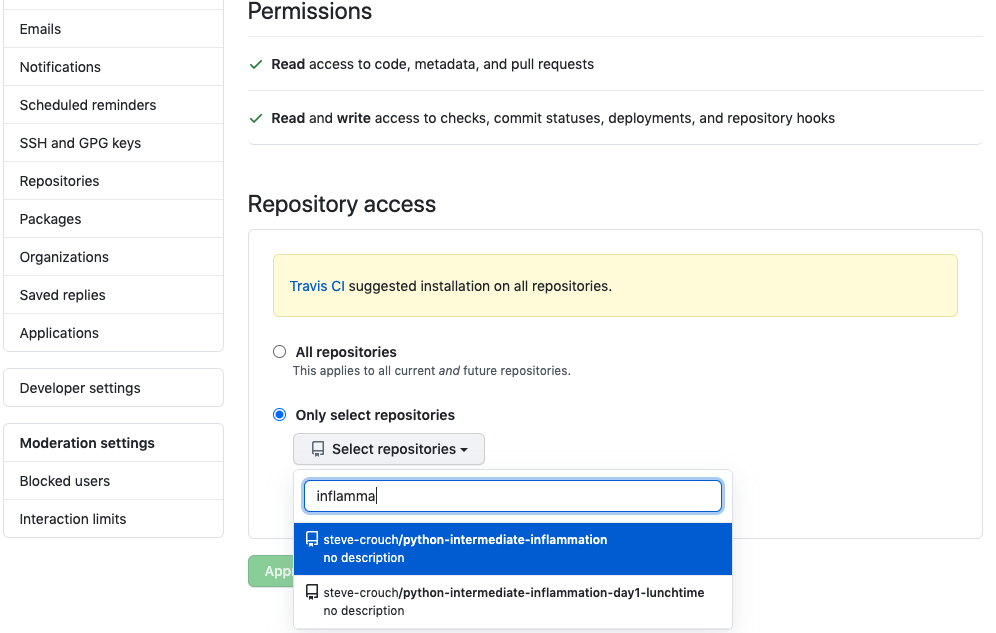
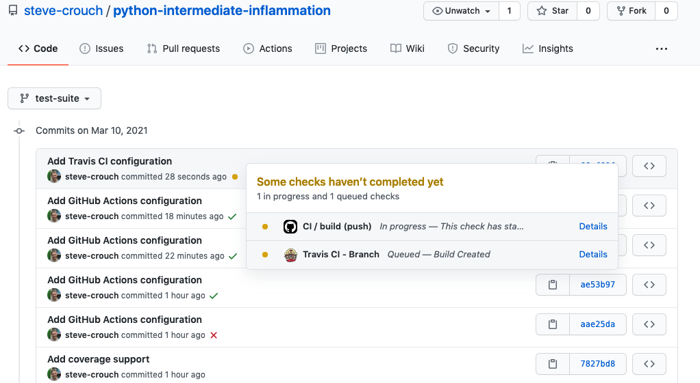
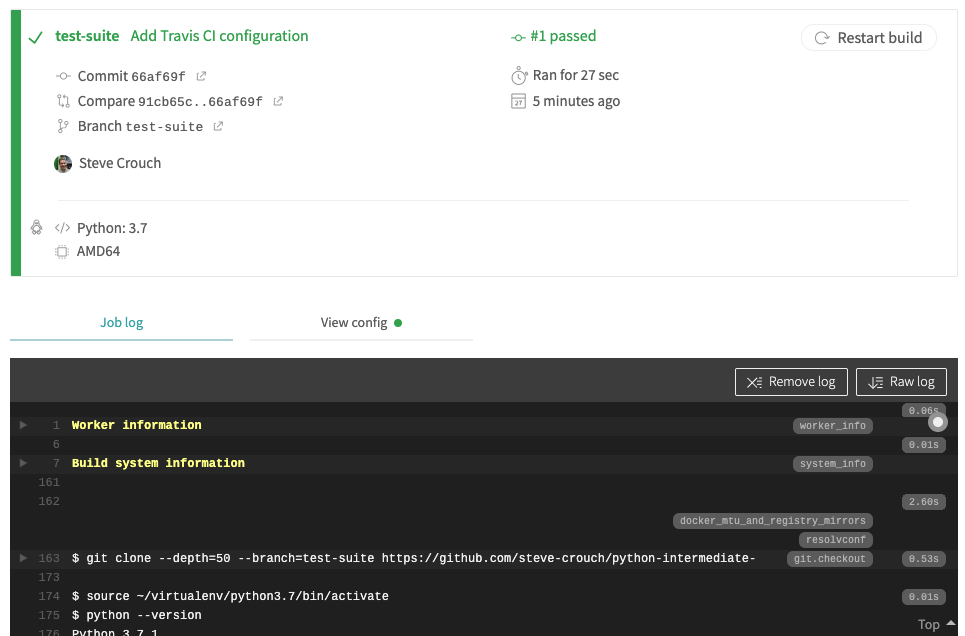

So far we've been manually running our tests as we require. So once we've made a change, or add a new feature with accompanying tests, we can re-run our tests, giving ourselves (and others who wish to run them) increased confidence that everything is working as expected. Now we're going to take further advantage of automation in a way that helps testing scale across a development team with very little overhead, using Continuous Integration.

## What is Continuous Integration?

The automated testing we've done so far only taking into account the state of the repository we have on our own machines. In a software project involving multiple developers working and pushing changes on a repository, it would be great to know holistically how all these changes are affecting our codebase without everyone having to pull down all the changes and test them. If we also take into account the testing required on different target user plaforms for our software and the changes being made to many repository branches, the effort required to conduct testing at this scale can quickly become intractable for a research project to sustain.

Continuous Integration (CI) aims to reduce this burden by further automation, and automation - wherever possible - helps us to reduce errors and makes predictable processes more efficient. The idea is that when a new change is committed to a repository, CI clones the repository, builds it if necessary, and runs any tests. Once complete, it presents a report to let you see what happened.

There are many CI infrastructures and services, free and paid for, and subject to change as they evolve their features. We'll be looking at two free ones, GitHub Actions - which unsurprisingly is available as part of GitHub - and a third party one called Travis. Both of these make use of common features across many CI implementations, and looking at both will illustrate some of the commonalities and differences in how such features are typically provided.

## Continuous Integration with GitHub Actions

With a GitHub repository there's a way we can set up CI to run our tests when we make a change, by adding a new file to our repository whilst on the `test-suite` branch. First, create the new directories `.github/workflows`:

~~~
$ mkdir -p .github/workflows
~~~
{: .language-bash}

This directory is used specifically for GitHub Actions, allowing us to specify any number of workflows that can be run under a variety of conditions. Next, add a file called `main.yml` within that directory:

~~~
name: CI

# We can specify which GitHub events will trigger a CI build
on: [push, pull_request]

# Next we define a single job 'build', but we could add more
jobs:

  build:

    # We can also specify which operating systems we want to test on
    runs-on: ubuntu-latest

    # A job is made up of a sequence of steps
    steps:

    # Next we need to checkout out repository, and set up Python
    # A 'name' is just an optional label shown in the log - helpful to clarify progress - and can be anything
    - name: Checkout repository
      uses: actions/checkout@v2

    - name: Set up Python
      uses: actions/setup-python@v2
      with:
        python-version: 3.7

    # We can use 'run' to execute commands
    - name: Install Python dependencies
      run: |
        pip install -r requirements.txt
        pip install -e .

    - name: Test with PyTest
      run: |
        pytest --cov=inflammation.models tests/test_models.py
~~~
{: .language-bash}

You'll notice that we are using the `pip` package manager here instead of `conda` to install our Python dependencies. This is because support within GitHub Actions and Travis CI for `pip` is much better and simpler to implement at present. We also use `pip install -e .`, an analogous Pip alternative to using `conda develop .`, to install our package in within the environment. But this does mean we need to create a separate `requirements.txt` file which `pip` can use to install Python package dependencies:

~~~
numpy==1.19.2
matplotlib==3.3.2
pytest==6.2.2
pytest-cov==2.11.1
~~~
{: .language-bash}

So similar to `environment.yml` for Anaconda, this file contains the Python packages - and their versions - our software will need to run. Note that we have omitted the plethora of other sub-packages that are also installed as part of installing these for simplicity.

### Triggering a build on GitHub Actions

Now if we commit and push this change a CI run will be triggered:

~~~
$ git add .github requirements.txt
$ git commit -m "Add GitHub Actions configuration"
$ git push
~~~
{: .language-bash}

Since we are only committing the GitHub Actions configuration file to the `test-suite` branch for the moment, only the contents of this branch will be used for CI. We can pass this file upstream into other branches (i.e. via merges) when we're happy it works, which will then allow the process to run automatically on these other branches. This again highlights the usefulness of the feature-branch model - we can work in isolation on a feature until it's ready to be passed upstream without disrupting development on other branches, and in the case of CI, we're starting to see its scaling benefits across a larger scale development team working across potentially many branches.

### Checking build progress and reports

Handily, we can see the progress of the build from our repository on GitHub by selecting the `test-suite` branch and then selecting `commits`.

You'll see a list of commits for this branch, and likely see an orange marker next to the latest commit (clicking on it yields `Some checks haven’t completed yet`) meaning the build is still in progress. This is a useful view, as over time, it will give you a history of commits, who did them, and whether the commit resulted in a successful build or not.

Hopefully after a while, the marker will turn green indicating a successful build. Selecting it gives you even more information about the build, and selecting `Details` link takes you to a complete log of the build and its output.

The logs are actually truncated; selecting the arrows next to the entries - which are the `name` labels we specified in the `main.yml` file - will expand them with more detail, including the output from the actions performed.

GitHub Actions offers these continuous integration features as a free service with 2000 Actions/minutes a month on as many public repositories that you like, although paid levels are available.

## Continuous Integration with an external CI service

Now let's take a look at Travis-CI, another free continuous integration service provided by a third-party. You'll notice many similarities between how Travis does it with GitHub Actions, but it should be pointed out that Travis did it first!

The first thing we need to do is let Travis install its GitHub App to GitHub:

1. Log into [https://travis-ci.com/]() with your GitHub account
2. Select your profile picture in the top right and select `Settings`.
3. Select the `Migrate` tab, then the `Activate all repositories using GitHub Apps` button. This will take you to GitHub.
4. From the `Repository access` section, select 'Only select repositories', and add the `python-intermediate-inflammation` repository
5. Select `Approve and install` to install the Travis application to GitHub.

Once we've done this, all we need to do now - whilst still on the `test-suite` branch - is add a `.travis.yml` file to the root of the repository, commit, and push it. For example:

~~~
language: python

python:
    - "3.7"

install:
    - pip install -r requirements.txt
    - pip install -e .

script:
    - pytest --cov=inflammation.models tests/test_models.py
~~~
{: .language-bash}

Here, we are informing Travis that the software assumes a Python 3.7 environment (which will be built and provided for the CI run), and the script to execute. We already have our software dependencies in our `requirements.txt` file, and as with GitHub Actions, Travis will automatically use this to install these dependencies using `pip` prior to running the script command.

### Triggering a build on Travis

As with GitHub Actions, we know that once a commit is pushed Travis will attempt to run a build, so if we commit and push this change a CI run will be triggered:

~~~
$ git add .travis.yml
$ git commit -m "Add Travis CI configuration"
$ git push
~~~
{: .language-bash}

Again, since we're only committing this to the `test-suite` branch, it will only build from that branch until we merge this file into upstream branches.

### Checking build progress and reports

The process of checking build progress is again similar to GitHub Actions, with Travis feeding back progress to GitHub - go to our repository on GitHub and select the `test-suite` branch and then `commits`. When you click on the orange build icon, notice that there is now *two* build indicators: one each for GitHub Actions and Travis, that are running simultaneously due to the change we just committed.

Selecting `Details` for the one associated with Travis gives us a summary of the build, and selecting `The build` link gives us a full progress report on the build, similar to GitHub Actions, and shows it alongside details of the GitHub Actions build.

Note that travis-ci.com also offers continuous integration as a free service, but with unlimited builds on as many open source (i.e. public) repositories that you have. But a key limitation is that only 5 concurrent build jobs may run at one time. Again, paid options are available.

## Scaling up testing using build matrices

Now we have our CI configured and building, we can use a feature called **build matrices** which really shows the value of using CI to test at scale.

Suppose the intended users of our software use either Ubuntu, Mac OS, or Windows, and either have Python version 3.7 or 3.8 installed, and we want to support all of these. Assuming we have a suitable test suite, it would take a considerable amount of time to set up testing platforms to run our tests across all these platform combinations. Fortunately, CI can do the hard work for us very easily.

Using a build matrix we can specify testing environments and parameters (such as operating system, Python version, etc.) and new jobs will be created that run our tests for each permutation of these.

Let's see how this is done using GitHub Actions (similar support for build matrices exists in Travis). To support this, change `.github/workflow/main.yml` to the following:

~~~
...
    runs-on: ${{ matrix.os }}
    strategy:
      matrix:
        os: [ubuntu-latest, macos-latest, windows-latest]
        python-version: [3.7, 3.8]

    steps:

    - name: Checkout repository
      uses: actions/checkout@v2
    - name: Set up Python
      uses: actions/setup-python@v2
      with:
        python-version: ${{ matrix.python-version }}
...
~~~
{: .language-bash}

Here, we are specifying a build strategy as a matrix of operating systems and Python versions, and using `matrix.os` and `matrix.python-version` to reference these configuration possibilities instead of using hardcoded values. The `${{ }}` are used as a means to reference these configurations.

Let's commit and push this change and see what happens:

~~~
$ git add .github/workflows/main.yml
$ git commit -m "Add GA build matrix for os and Python version"
$ git push
~~~
{: .language-bash}

If we go to our GitHub build now, we can see that a new job has been created for each permutation.

Note all jobs running in parallel (up to the limit allowed by our account) which potentially saves us a lot of time waiting for testing results. Overall, this approach allows us to massively scale our automated testing across platforms we wish to test.

## Merging back to dev

Now we're happy with our test suite, we can merge this work (which currently only exist on our `test-suite` branch) with our parent `develop` branch. Again, this reflects us working with impunity on a logical unit of work, involving multiple commits, on a separate feature branch until it's ready to be escalated to the develop branch:

~~~
$ git checkout develop
$ git merge test-suite
~~~
{: .language-bash}

Then, assuming no conflicts we can push these changes back to the remote repository as we've done before:

~~~
$ git push origin develop
~~~
{: .language-bash}

Now these changes have migrated to our parent `develop` branch, `develop` will also inherit the configuration to run CI builds, so these will run automatically on this branch as well.

This highlights a big benefit of CI when you perform merges (and apply pull requests). As new branch code is merged into upstream branches like `dev` and `master` this newly integrated code changes are automatically tested *together* with existing code - which of course may also have changed in the meantime!


