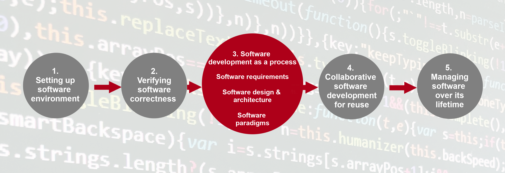

In this section, we will take a step back from coding development practices and tools and look at the bigger picture of software as a *process* of development: from good software design based on clear requirements to an implementation that meets those requirements, and how doing these things well makes it easier for others to develop and reuse our software.

We will first look a bit past the language specifics and capabilities of Python and into 
different software design paradigms and design architectures to understand a broader set of approaches 
you can take to design software. Modern software will often contain instances of multiple paradigms so it is 
worthwhile being familiar with them and knowing when to switch in order to make maintainable code. 
Normally, you would make these design considerations early on - before you even start writing code. 
However, sometimes you
inherit code from someone else or you yourself have written some code that now needs to grow and become more robust.
At this point, before your software grows even more and becomes harder to manage,
it becomes particularly important that you rethink its design.

FIXME: code review

After that, we'll look at some general principles of software maintainability, the benefits that writing maintainable 
code can give you, and also getting some practice at identifying problems with existing code, and
some general, established practices you can apply when writing new code or to the code you've already written.
Sometimes project goals and time pressures take precedence and producing maintainable, reusable code is not given the 
time it deserves. So, when a change or a new feature is needed - often the shortest route to making it work is taken 
as opposed to a more well thought-out solution. For this reason, it is important not to write the code alone and in 
isolation and use other team members to measure our coding standards against and check and verify each other's code.

{: .image-with-shadow width="800px" }


