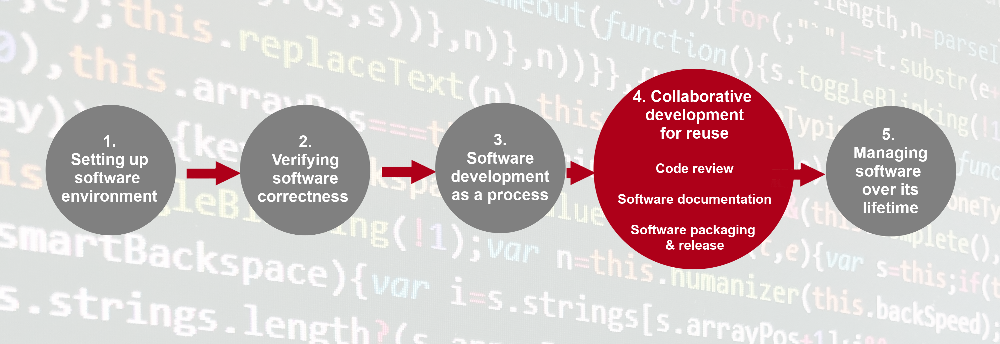

So far in this course we've focused on learning technical practices, tools, and infrastructure that help the development of software in a team environment, but in an individual setting. In this section of the course we look at how to improve the reusability of our software for others as well as ourselves, the importance of critical reflection, and what we need to take into account when sharing our code with others, in the context of working as a team. We'll also be making use of skills learnt previously in the course.

The focus in this section will also move beyond software development to **management**: management of how the outside world interacts with and makes use of our software, how others can interact with ourselves to report issues, and the ways we can successfully manage software improvement in response to feedback.

{: .image-with-shadow width="800px" }

In this section we will:

- Look at how to **prepare our software for release**, looking at what we actually mean by software reusability, the importance of good documentation, as well as what to consider when choosing an open source licence.
- Explore ways for us to **track issues with our software** registered by ourselves and external users, and how we should employ a critical mindset when reviewing software for reuse.
- Examine how we can manage the **improvement of our software through feedback** using agile management techniques. We'll employ effort estimation of development tasks as a foundational tool for prioritising future team work, and use the MoSCoW approach and software development sprints to manage improvement. As we will see, it is very difficult to prioritise work effectively without knowing both its relative importance to others as well as the effort required to deliver those work items.


